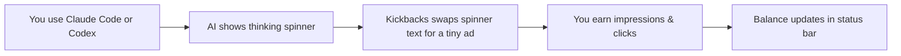

# Kickbacks Setup Kit

**The easiest way to install [Kickbacks.ai](https://kickbacks.ai) and start earning from Claude Code & Codex while you code.**

Turn the “Discombobulating…” spinner into passive income — up to **50% of ad revenue** back to you. Works in **Cursor**, **VS Code**, and the **Claude Code terminal**. Free. Takes ~10 minutes.

[](https://kickbacks.ai)
[](https://marketplace.visualstudio.com/items?itemName=Kickbacksai.kickbacks-ai)
[](https://marketplace.visualstudio.com/items?itemName=Kickbacksai.kickbacks-ai)
[](https://marketplace.visualstudio.com/items?itemName=Kickbacksai.kickbacks-ai)
[](./INSTRUCTIONS.md)
[](https://github.com/ckryptickunal/kickbacks-setup/stargazers)
[](./LICENSE)

> **Community setup guide** — not affiliated with ShiftKeys, Inc. or Kickbacks.ai.  
> Official support: [support@kickbacks.ai](mailto:support@kickbacks.ai) · [Extension issues](https://github.com/andrewmccalip/kickbacks.ai/issues)

**⭐ If this repo saves you time, star it** so others searching “Kickbacks Cursor setup” or “how to install Kickbacks.ai” can find it too.

---

## Table of contents

- [Why use this repo?](#why-use-this-repo)
- [How Kickbacks works](#how-kickbacks-works)
- [What to expect (honest status)](#what-to-expect-honest-status)
- [Pick your path](#pick-your-path)
- [5-minute setup (Cursor & VS Code)](#5-minute-setup-cursor--vs-code)
- [Setup with an AI agent](#setup-with-an-ai-agent)
- [Earnings, payouts & eligibility](#earnings-payouts--eligibility)
- [Compatibility](#compatibility)
- [Troubleshooting quick fixes](#troubleshooting-quick-fixes)
- [Share with your team](#share-with-your-team)
- [FAQ](#faq)
- [All docs & files](#all-docs--files)

---

## Why use this repo?

Official Kickbacks docs are spread across the [website](https://kickbacks.ai), [marketplace listing](https://marketplace.visualstudio.com/items?itemName=Kickbacksai.kickbacks-ai), and [GitHub mirror](https://github.com/andrewmccalip/kickbacks.ai). **This repo puts everything in one place** — tested, ordered, and ready to hand to a human *or* an AI agent.

| What you get | Why it matters |
|--------------|----------------|
| **[USER-GUIDE.md](./USER-GUIDE.md)** — plain-English steps | No terminal required. Paste into Google Docs for your team. |
| **[INSTRUCTIONS.md](./INSTRUCTIONS.md)** — 25-step agent runbook | Cursor / Claude Code can install extensions and troubleshoot for you. |
| **[docs/TROUBLESHOOTING.md](./docs/TROUBLESHOOTING.md)** | Fixes for “Kickbacks incompatible”, sign-in errors, $0 balance. |
| **[docs/FAQ.md](./docs/FAQ.md)** | Privacy, payouts, Cursor vs VS Code, terminal-only users. |
| **[SHARE.md](./SHARE.md)** | Copy-paste messages for Slack, Discord, X, and email. |

**Built for search:** keywords like *Kickbacks.ai setup*, *Kickbacks Cursor*, *Kickbacks VS Code*, *Claude Code earn money*, and *Kickbacks incompatible fix* are covered throughout.

---

## How Kickbacks works



1. **Claude Code** or **Codex** shows a spinner while working (*“Baking…”*, *“Discombobulating…”*).
2. **Kickbacks** replaces that line with a small sponsored message — advertisers bid for the slot.
3. **You earn** on impressions and clicks (clicks pay ~**50×** more than impressions).
4. **Your balance** appears in the editor status bar and on [kickbacks.ai](https://kickbacks.ai).

**Privacy:** Kickbacks only changes display text. It does **not** read your code, prompts, files, or AI replies. It sends ad/visibility events, a per-install ID, and your account email after sign-in. IPs are stored only as a salted one-way hash. Fully reversible with **Kickbacks: Restore Claude Code**.

---

## What to expect (honest status)

Kickbacks is **early** (as of June 2026). Set expectations correctly before you spend 10 minutes installing it:

- 💵 **You earn an estimated 50% of *net* ad revenue** — credited per qualifying impression (ad visible ≥ 5s during real coding) and per click (~50× an impression).
- 🌱 **It's bootstrapping.** The platform is seeding its own ad inventory while it onboards real advertisers, so early balances are typically small.
- 🏦 **Payouts are monthly via Stripe Connect** once your balance crosses **US $10** (tax forms required). **Some countries can't cash out yet** — including **India, Pakistan, Bangladesh, Nigeria, and Vietnam**. [Check before installing →](./docs/FAQ.md#which-countries-can-receive-payouts)
- ✅ **One account per person, genuine usage only.** No bots, scripts, or fake clicks — that's how accounts get banned. [Stay eligible →](#earnings-payouts--eligibility)

> This is a community guide, not a get-rich-quick scheme. Install it because the ads are unobtrusive and the upside is free — not because it'll replace your salary.

---

## Pick your path

| You are… | Start here | Time |
|----------|------------|------|
| 👤 **New to extensions** — want clicks, not commands | [**USER-GUIDE.md**](./USER-GUIDE.md) | ~10 min |
| 🤖 **Using Cursor, Claude Code, or Copilot** | [**INSTRUCTIONS.md**](./INSTRUCTIONS.md) or [**AGENTS.md**](./AGENTS.md) | ~15 min |
| 🔧 **Stuck on an error** | [**docs/TROUBLESHOOTING.md**](./docs/TROUBLESHOOTING.md) | ~2 min |
| 📣 **Sharing with friends or a team** | [**SHARE.md**](./SHARE.md) | ~1 min |

---

## 5-minute setup (Cursor & VS Code)

> **Install order matters:** Claude Code **first**, then Kickbacks. Skipping this causes `Kickbacks incompatible` errors. [Details →](./docs/TROUBLESHOOTING.md#kickbacks-incompatible)

### Step 1 — Install Claude Code (skip if installed)

1. Open **Cursor** or **VS Code**
2. **Extensions** (`Cmd/Ctrl + Shift + X`) → search **Claude Code**
3. Install **Claude Code** by Anthropic
4. Open the Claude panel once (spark icon or status bar)

*Using Codex instead?* Install **ChatGPT** by OpenAI from Extensions.

### Step 2 — Install Kickbacks

1. **Extensions** → search **Kickbacks**
2. Install [**Kickbacks.ai**](https://marketplace.visualstudio.com/items?itemName=Kickbacksai.kickbacks-ai)
3. **Cmd/Ctrl + Shift + P** → **Developer: Reload Window**

### Step 3 — Sign in & earn

1. Click **Kickbacks: Sign in** in the bottom status bar
2. Sign in with **Google** in your browser
3. Confirm status shows **`Kickbacks ($0.00 today · $0.00)`**
4. Use Claude or Codex normally — earnings accrue while they think

**Preview ads before sign-in do not count.** You must sign in to earn.

→ Full walkthrough with status bar meanings: [**USER-GUIDE.md**](./USER-GUIDE.md)

---

## Setup with an AI agent

Paste this into **Cursor**, **Claude Code**, or any agent that can fetch URLs:

```
Fetch and execute INSTRUCTIONS.md from https://github.com/ckryptickunal/kickbacks-setup
Run STEP-001 onward. Report PASS/FAIL after each ACTION. Stop at every GATE until I reply.
Install extensions in order: Claude Code first, then Kickbacks.
```

**Raw URL** (no clone needed):  
`https://raw.githubusercontent.com/ckryptickunal/kickbacks-setup/main/INSTRUCTIONS.md`

Agents follow a 25-step runbook: detect your editor, install extensions, guide sign-in, run smoke tests, and produce a completion report.

---

## Earnings, payouts & eligibility

| Topic | Detail |
|-------|--------|
| **Revenue share** | Estimated **50%** of **net** ad revenue to you |
| **Impressions** | Earn when an ad is visible **≥ 5 seconds** during a real request |
| **Clicks** | Worth ~**50×** an impression |
| **Where balance shows** | Editor status bar + [kickbacks.ai](https://kickbacks.ai) ledger |
| **Payout method** | Monthly via **Stripe Connect** (tax forms required) |
| **Payout threshold** | Balance must cross **US $10** |
| **Country limits** | India, Pakistan, Bangladesh, Nigeria, Vietnam **can't cash out yet** — [details](./docs/FAQ.md#which-countries-can-receive-payouts) |
| **Caps** | Hourly/daily limits may pause earning — ads still show |

**Four ad surfaces:** Claude Code panel spinner · Codex panel spinner · Terminal status line · Terminal spinner verb (CLI 2.1.143+)

### Stay eligible (ground rules)

Kickbacks bans accounts that game the system. To keep your earnings:

- ✅ **One account per person** — no account networks or alts
- ✅ **Real usage only** — no bots, scripts, or auto-clickers to inflate impressions
- ✅ **Don't tamper with telemetry** or circumvent caps
- ✅ Let ads display naturally during genuine coding — that's all that counts

[Full fraud ground rules → kickbacks.ai/faq](https://kickbacks.ai/faq)

---

## Compatibility

| Surface | Where ads show | You need |
|---------|----------------|----------|
| Spinner overlay | Claude Code panel | Claude Code + Kickbacks |
| Thinking shimmer | Codex / ChatGPT panel | OpenAI ChatGPT ext + Kickbacks |
| Status-bar line | `claude` in terminal | Any Claude Code CLI |
| Spinner verb | `claude` in terminal | Claude Code **2.1.143+** |

✅ **VS Code** · ✅ **Cursor** · ✅ **Remote-SSH** · ✅ **Dev containers**

Even **terminal-only** users need the Claude Code + Kickbacks extensions installed in the editor (sign-in happens there). [Why? → FAQ](./docs/FAQ.md#i-only-use-claude-in-terminal-do-i-still-need-the-editor-extension)

---

## Troubleshooting quick fixes

| Problem | Fix |
|---------|-----|
| `Kickbacks incompatible` | Uninstall Kickbacks → reinstall Claude Code → reinstall Kickbacks → Reload Window. [Full guide →](./docs/TROUBLESHOOTING.md#kickbacks-incompatible) |
| `Kickbacks: Sign in` missing | Reinstall in correct order. [Guide →](./docs/TROUBLESHOOTING.md#sign-in-command-not-found) |
| Balance stays $0.00 | Sign in? Preview ads don't count. Hit a cap? Need reload? [Guide →](./docs/TROUBLESHOOTING.md#balance-stays-000) |
| `code` CLI installs fail on Mac | Your `code` may point to Cursor — use `cursor` CLI instead. [Guide →](./docs/TROUBLESHOOTING.md#extension-not-found-on-mac) |
| ⚠ RELOAD to earn money | Cmd/Ctrl+Shift+P → **Developer: Reload Window** |

→ **[Full troubleshooting guide](./docs/TROUBLESHOOTING.md)**

---

## Share with your team

Know someone using Claude Code or Cursor? Send them this repo — setup takes ~10 minutes and costs nothing.

**One-liner for Slack / Discord / iMessage:**

> Free setup guide for Kickbacks.ai — earn up to 50% of ad revenue while Claude/Codex thinks. Works in Cursor & VS Code: https://github.com/ckryptickunal/kickbacks-setup

More copy-paste templates (email, X, team docs): [**SHARE.md**](./SHARE.md)

**Found this helpful?** ⭐ Star the repo · 🍴 Fork for your team · 🐛 [Report a doc issue](https://github.com/ckryptickunal/kickbacks-setup/issues/new/choose)

---

## FAQ

<details>
<summary><strong>Does Kickbacks slow down Claude or Codex?</strong></summary>

No. It only changes spinner display text during wait states. All AI features work exactly as before.
</details>

<details>
<summary><strong>Is my code safe?</strong></summary>

Yes. Kickbacks never reads your files, prompts, completions, or AI responses. It sends ad/visibility events, extension/host versions, and a per-install ID; after sign-in it links your account email. IPs are kept only as a salted, one-way hash for fraud checks. [Privacy details →](https://kickbacks.ai/faq)
</details>

<details>
<summary><strong>Can I actually cash out — and where?</strong></summary>

Payouts run monthly through Stripe Connect once your balance passes US $10 (tax forms required). A few countries can't receive payouts yet — including India, Pakistan, Bangladesh, Nigeria, and Vietnam. Check the [country list](./docs/FAQ.md#which-countries-can-receive-payouts) before you install.
</details>

<details>
<summary><strong>Cursor or VS Code — which is better?</strong></summary>

Both work identically. Kickbacks officially supports Cursor the same as VS Code.
</details>

<details>
<summary><strong>Can I turn ads off?</strong></summary>

Yes. Click the status bar → **Disable Kickbacks**, or run **Kickbacks: Restore Claude Code** to fully revert.
</details>

→ **[Full FAQ with 20+ answers](./docs/FAQ.md)**

---

## All docs & files

```
kickbacks-setup/
├── README.md                 ← Start here
├── USER-GUIDE.md             ← Human setup (Google Docs friendly)
├── INSTRUCTIONS.md           ← AI agent runbook (STEP-001 … STEP-025)
├── AGENTS.md                 ← Agent entry point
├── SHARE.md                  ← Copy-paste share messages
├── docs/
│   ├── FAQ.md                ← Searchable Q&A
│   └── TROUBLESHOOTING.md    ← Error fixes
└── CONTRIBUTING.md           ← Improve this repo
```

---

## Official Kickbacks links

| Resource | URL |
|----------|-----|
| Website & payouts | https://kickbacks.ai |
| Install extension | https://marketplace.visualstudio.com/items?itemName=Kickbacksai.kickbacks-ai |
| Extension source | https://github.com/andrewmccalip/kickbacks.ai |
| Extension bugs | https://github.com/andrewmccalip/kickbacks.ai/issues |

---

## Contributing & license

Improvements welcome — typos, new troubleshooting steps, platform-specific tips. See [**CONTRIBUTING.md**](./CONTRIBUTING.md).

Documentation in this repo is [**MIT licensed**](./LICENSE). Kickbacks.ai is a trademark of its respective owner.

---

<p align="center">
  <strong>⭐ Star this repo if it helped you set up Kickbacks.ai</strong><br>
  <sub>Helps others find the best Kickbacks setup guide on GitHub</sub>
</p>

<p align="center">
  <sub>Facts last verified <strong>2026-06-16</strong> against kickbacks.ai, kickbacks.ai/faq, and the VS Code Marketplace (extension v0.3.177). Numbers like the payout threshold and country list can change — confirm on <a href="https://kickbacks.ai/faq">kickbacks.ai/faq</a>.</sub>
</p>
